# [PROJECT 1 GROUPTRAINING](https://davidfb94.github.io/project-1-grouptraining)

# GymBuddies

## Overview

GymBuddies is a web-page for a potential fitness-center in Stockholm City.

This page is meant to work as a notice board. This is where potential customers get their first look, where they can go to learn about what the center has to offer, contact information, how to find it, and to sign up. It also serves as a place where already enrolled customers can find the weekly schedule for the centers different activities.

""This website was built as a project for Diploma in Full Stack Software Development at Code Institute.""

### Mock-up

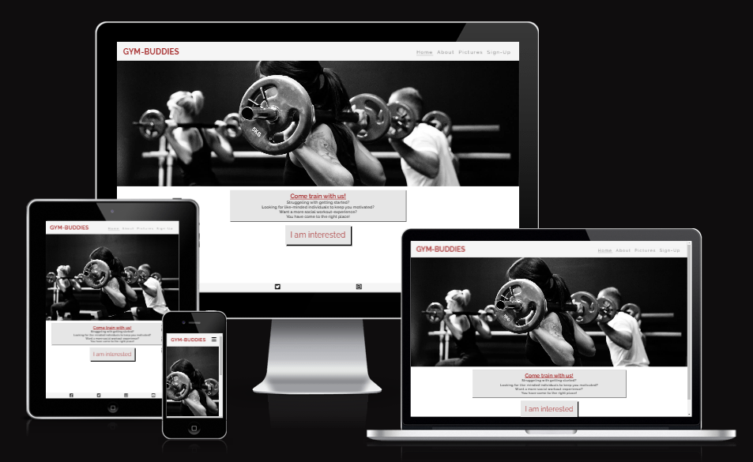

## UX

I started out with Wireframes for both desktop and phone.

I realized quickly that my idea to have text over images would make it difficult to read, so I changed the plan, and had the hero image displayed at the top, and text content beneath it.

After creating the basic structure for the different pages, the site felt a bit lackluster. I added the "About" page to add more features to the site, and moved some text content from the home page. The home page became more of a font/welcome page.

### Colour Scheme

I based my colors around the hero image. Since it is black and white, I want to keep the colors simple, but still add enough contrast and variation for readability. I was going for a clean and simple look.

- `#A52A2a` used for primary text.
- `#000000` used for secondary text.

I used [coolors.co](https://coolors.co/f5f5f5-e6e6e6-a52a2a-000000-ffffff) to generate my colour palette.

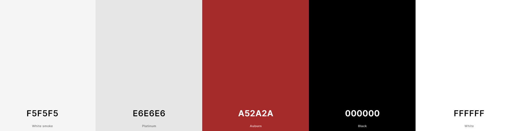

### Typography

I used Google fonts for fonts import.

Font awesome for the fav-icon and footer icons.

- [Raleway](https://fonts.google.com/specimen/Raleway?query=ralewa) was used for all text content

- [Font Awesome](https://fontawesome.com) icons were used throughout the site, such as the social media icons in the footer.

## Wireframes

I've used [Balsamiq](https://balsamiq.com/wireframes) to design my site wireframes.

### Mobile Wireframes

 Click here to see the Mobile Wireframes 

Home

- 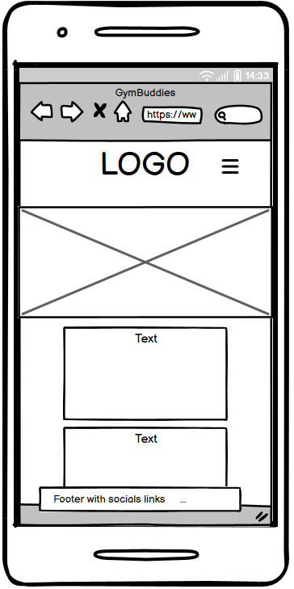

About

- 

Pictures

- 

Sign-up

- 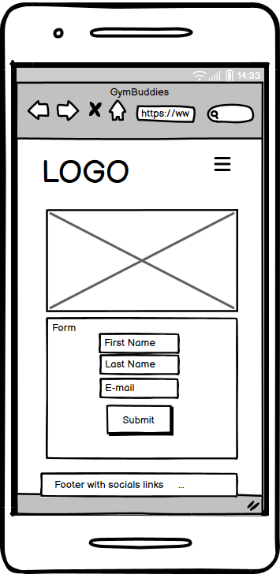

### Desktop Wireframes

 Click here to see the Desktop Wireframes 

Home

- 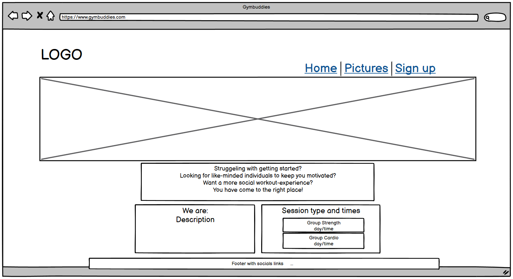

About

- 

Pictures

- 

Sign-up

- 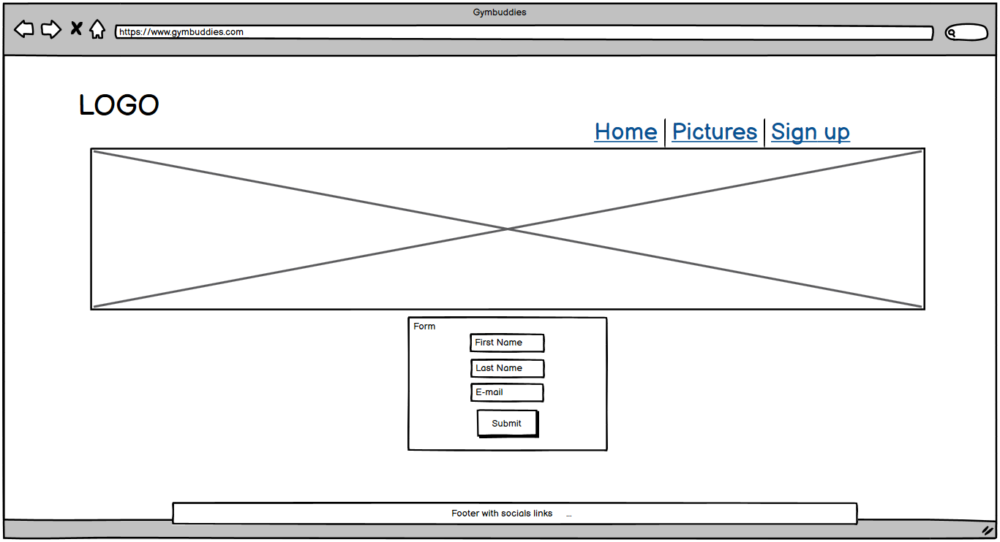

## Features

### Existing Features

- **Logo with home navigation**

  - Adds maneuverability to the site, and makes it faster for the user to navigate to the home screen on mobile (less clicks when not using the drop-down navigation)

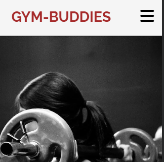

- **Navigation bar with toggle for smaller screens**

  - Adds maneuverability to the site, and makes it easier for the user to navigate the website on mobile, while also saving screen space.

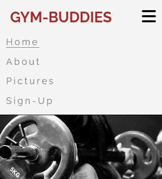

- **I am interested - button**

  - For guidance to the about section. It will take a potential customer to the about section in an intuitive way, where they can find relevant information for deciding if this is a product they would be interested in.

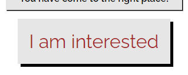

- **Weekly schedule section**

  - Allows the fitness-center to show the customers the available activities for the week, and when they will happen. The schedule gets updated on a week to week basis.

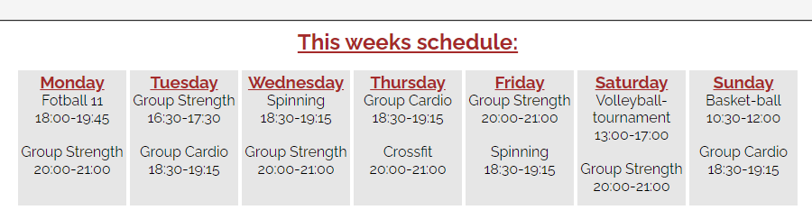

- **Description section**

  - Allows the fitness-center to give a short description on who they are, and what activities they offer to their enrolled customers.

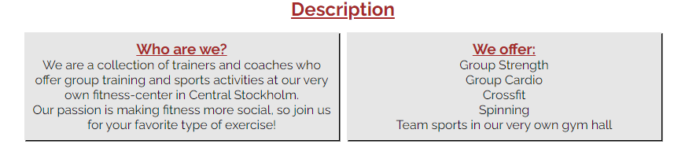

- **Contact section**

  - Allows the fitness-center to make their contact information easy to find, in case a customer needs to get in touch with them.

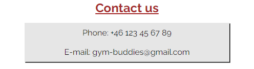

- **Embedded map section**

  - Clickable "more options" to open google directions in a new tab for easy navigation to the fitness-center.

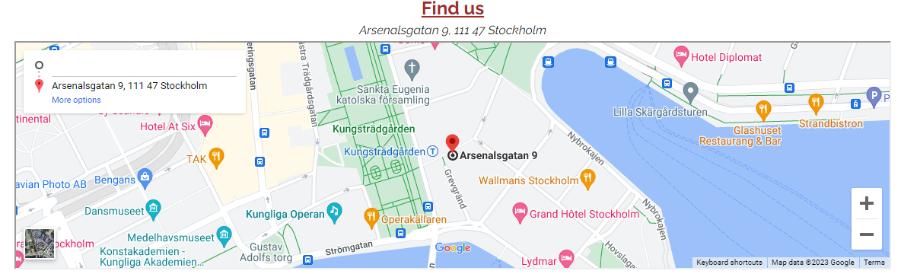

- **Pictures page**

  - Allows the fitness-center to show customer some examples of what they can expect while attending the different activities. Based on screen size, the page will display the pictures in 1-3 columns.

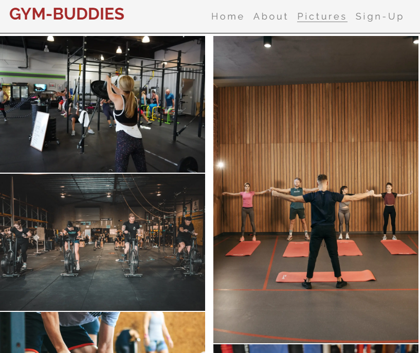

- **Sign-up form with validation page**

  - Allows the potential customer to sign up in a quick and intuitive way. Allows the fitness-center to quickly reach out to the customer. The form includes input validation, to ensure that the correct type of input is used, and every input field is filled in.

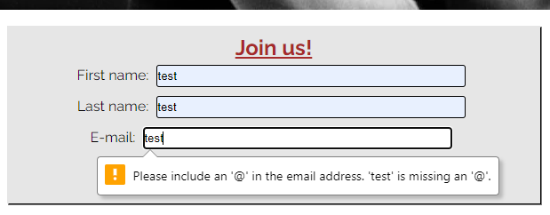

### Future Features

- Calendar with booking-functionality (in new page)
- Sign-in function to check bookings
- Booking halls with empty time-slots for private activities

## Tools & Technologies Used

- [HTML](https://en.wikipedia.org/wiki/HTML) used for the main site content.
- [CSS](https://en.wikipedia.org/wiki/CSS) used for the main site design and layout.
- [CSS Flexbox](https://www.w3schools.com/css/css3_flexbox.asp) used for an enhanced responsive layout.
- [Git](https://git-scm.com) used for version control. (`git add`, `git commit`, `git push`)
- [GitHub](https://github.com) used for secure online code storage.
- [GitHub Pages](https://pages.github.com) used for hosting the deployed front-end site.
- [Codeanywhere](https://codeanywhere.com) used as a cloud-based IDE for development.

## Testing

For all testing, please refer to the [TESTING.md](TESTING.md) file.

## Deployment

The site was deployed to GitHub Pages. The steps to deploy are as follows:

- In the [GitHub repository](https://github.com/DavidFB94/project-1-grouptraining), navigate to the Settings tab
- From the source section drop-down menu, select the **Main** Branch, then click "Save".
- The page will be automatically refreshed with a detailed ribbon display to indicate the successful deployment.

The live link can be found [here](https://davidfb94.github.io/project-1-grouptraining)

### Local Deployment

This project can be cloned or forked in order to make a local copy on your own system.

#### Cloning

You can clone the repository by following these steps:

1. Go to the [GitHub repository](https://github.com/DavidFB94/project-1-grouptraining)
2. Locate the Code button above the list of files and click it
3. Select if you prefer to clone using HTTPS, SSH, or GitHub CLI and click the copy button to copy the URL to your clipboard
4. Open Git Bash or Terminal
5. Change the current working directory to the one where you want the cloned directory
6. In your IDE Terminal, type the following command to clone my repository:
	- `git clone https://github.com/DavidFB94/project-1-grouptraining.git`
7. Press Enter to create your local clone.

Alternatively, if using Gitpod, you can click below to create your own workspace using this repository.

Please note that in order to directly open the project in Gitpod, you need to have the browser extension installed.
A tutorial on how to do that can be found [here](https://www.gitpod.io/docs/configure/user-settings/browser-extension).

#### Forking

By forking the GitHub Repository, we make a copy of the original repository on our GitHub account to view and/or make changes without affecting the original owner's repository.
You can fork this repository by using the following steps:

1. Log in to GitHub and locate the [GitHub Repository](https://github.com/DavidFB94/project-1-grouptraining)
2. At the top of the Repository (not top of page) just above the "Settings" Button on the menu, locate the "Fork" Button.
3. Once clicked, you should now have a copy of the original repository in your own GitHub account!

### Local VS Deployment

No significant differences between local and deployed version.

## Credits

The basic structure for header/main/footer and navbar+toggle was created by following along the Love Running Project Challenge.

The Pictures page was also created by borrowing code from the Love Running Project Challenge.

Embedded map code from google.com/maps.

The remaining content was created by the developer, with the help of Code Institutes learning platform, w3schools.com and stackoverflow.com for general questions about code structure and syntax.

### Content

| Source | Location | Notes |
| --- | --- | --- |
| [Markdown Builder](https://tim.2bn.dev/markdown-builder) | README and TESTING | tool to help generate the Markdown files |
| [W3Schools](https://www.w3schools.com/) | entire site | how to position elements and flex-box usage |
| [StackOverflow](https://stackoverflow.com/) | entire site | how to position elements and flex-box usage |
| [ui.dev](https://ui.dev/) | <https://ui.dev/amiresponsive> | used to create mock-up images |
| [Stackedit](https://stackedit.io/) | entire site | Markdown editor |

### Media

| Source | Location | Type | Notes |
| --- | --- | --- | --- |
| [Unsplash](https://unsplash.com/) | <https://unsplash.com/photos/three-person-lifting-barbels-Lx_GDv7VA9M> | image| hero image |
| [Unsplash](https://unsplash.com/) | <https://unsplash.com/photos/people-doing-exercise-inside-gym-3eqaaqdL_IM> | image| sample gym photo |
| [Unsplash](https://unsplash.com/) | <https://unsplash.com/photos/a-group-of-people-riding-stationary-bikes-in-a-gym-6FvUvDPsKV8> | image| sample gym photo |
|[Pexels](https://www.pexels.com/)|<https://www.pexels.com/sv-se/foto/man-manniskor-sport-klubb-703012/|image> | sample gym photo |
|[Pexels](https://www.pexels.com/)|<https://www.pexels.com/sv-se/foto/hander-manniskor-ben-man-2261485/|image> | sample gym photo |
|[Pexels](https://www.pexels.com/)|<https://www.pexels.com/sv-se/foto/man-kvinna-sport-kraft-6455806/|image> | sample gym photo |
|[Pexels](https://www.pexels.com/)|<https://www.pexels.com/sv-se/foto/manniskor-ung-kondition-stretcha-6339352/|image> | sample gym photo |
| [Fontawesome](https://fontawesome.com/) | entire site | image | fav- and footer icons |
| [TinyPNG](https://tinypng.com) | entire site | image | tool for image compression |

### Acknowledgements

- I would like to thank my Code Institute mentors, [Tim Nelson](https://github.com/TravelTimN) and Luke Buchanan for their support throughout the development of this project.
- I would like to thank my partner Maria for believing in me, and allowing me to make this transition into software development.
