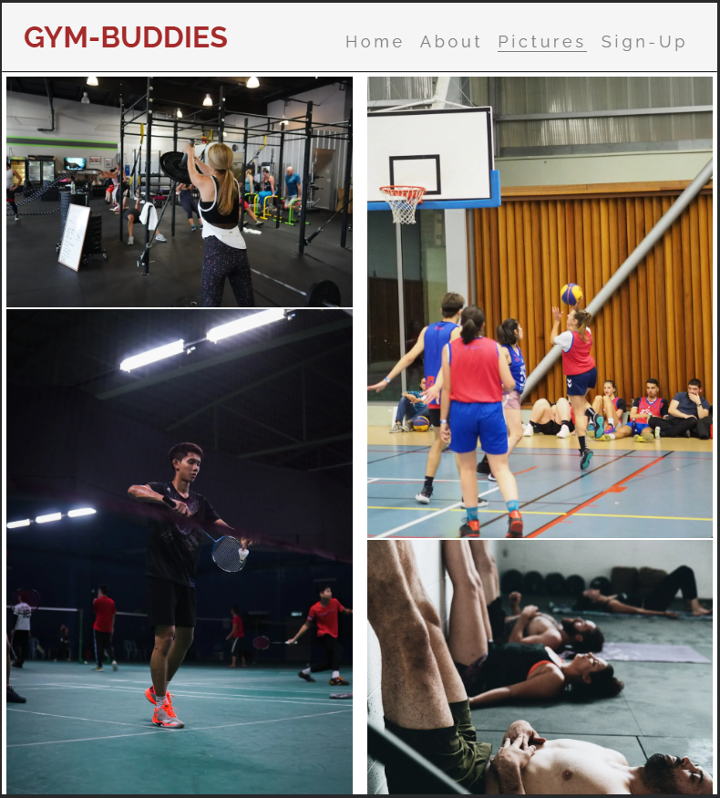
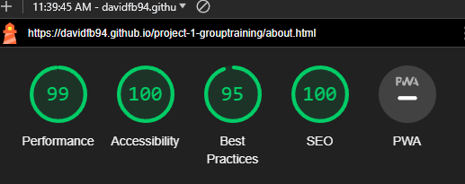
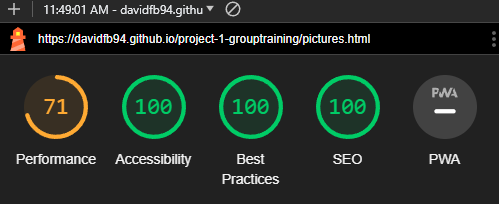
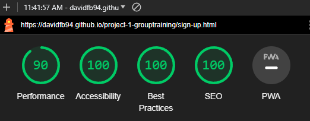

# Testing

Return back to the [README.md](README.md) file.

## Code Validation

### HTML

I have used the recommended [HTML W3C Validator](https://validator.w3.org) to validate all of my HTML files.

| Page | W3C URL | Screenshot | Notes |
| --- | --- | --- | --- |
| Home | [W3C](https://validator.w3.org/nu/?doc=https%3A%2F%2Fdavidfb94.github.io%2Fgym-buddies%2Findex.html) |  | Section lacks header h2-h6 warning |
| About | [W3C](https://validator.w3.org/nu/?doc=https%3A%2F%2Fdavidfb94.github.io%2Fgym-buddies%2Fabout.html) |  | Pass: No Errors|
| Pictures| [W3C](https://validator.w3.org/nu/?doc=https%3A%2F%2Fdavidfb94.github.io%2Fgym-buddies%2Fpictures.html) |  | Pass: No Errors |
| Sign-up | [W3C](https://validator.w3.org/nu/?doc=https%3A%2F%2Fdavidfb94.github.io%2Fgym-buddies%2Fsign-up.html) |  | End tag with open element, unclosed element, stray div. Fixed.|
| Confirmation | [W3C](https://validator.w3.org/nu/?doc=https%3A%2F%2Fdavidfb94.github.io%2Fgym-buddies%2Fconfirmation.html%3Ff-name%3DTesting%26l-name%3DTesting%26email%3Dtesting%2540testing.com) |  | Section lacks header h2-h6 warning |

### CSS

I have used the recommended [CSS Jigsaw Validator](https://jigsaw.w3.org/css-validator) to validate all of my CSS files.

| File | Jigsaw URL | Screenshot | Notes |
| --- | --- | --- | --- |
| style.css | [Jigsaw](https://jigsaw.w3.org/css-validator/validator?uri=https%3A%2F%2Fdavidfb94.github.io%2Fgym-buddies%2F&profile=css3svg&usermedium=all&warning=1&vextwarning=&lang=sv) |  | Pass: No Errors |

## Browser Compatibility

I've tested my deployed project on multiple browsers to check for compatibility issues.

| Browser | Home | About | Pictures | Sign-up | Confirmation | Notes |
| --- | --- | --- | --- | --- | --- | --- |
| Google Chrome |  |  |  |  |  | Works as expected |
| Firefox Developer Edition |  |  |  |  |  | Works as expected |
| Microsoft Edge |  |  |  |  |  | Works as expected |

## Responsiveness

I've tested my deployed project on multiple devices to check for responsiveness issues.

| Device | Home | About | Pictures | Sign-up | Confirmation | Notes |
| --- | --- | --- | --- | --- | --- | --- |
| Mobile (DevTools) |  |  |  |  |  | Works as expected |
| Tablet (DevTools) |  |  |  |  |  | Works as expected |
| Desktop |  |  |  |  |  | Works as expected |
| Sony Xperia 10 |  |  |  |  |  | Works as expected |

## Lighthouse Audit

I've tested my deployed project using the Lighthouse Audit tool to check for any major issues.

| Page | Mobile | Desktop | Notes |
| --- | --- | --- | --- |
| Home |  |  | Some minor warnings |
| About |  |  | Some minor warnings |
| Pictures|  |  | Warning for image file sizes. Attempted fix: Image compression and format change. |
| Sign-up|  |  | Some minor warnings |
| Confirmation|  |  | Some minor warnings. Accessibility fixed. |

## Bugs

- : `Background and foreground colors do not have sufficient contrast ratio`

    

  - To fix this, I modified the color slightly, and increased the font weight.

## Unfixed Bugs

- There are no remaining bugs that I am aware of.
  